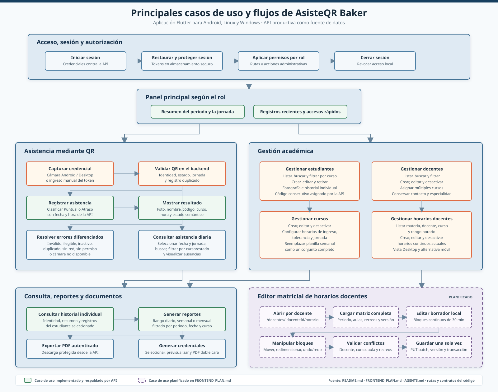

# Diagrama de casos de uso de AsisteQR Baker

El diagrama resume los flujos descritos en `README.md`, `FRONTEND_PLAN.md` y
`AGENTS.md`, contrastados con las rutas y los contratos de repositorio presentes
en `lib/`. Los bloques de borde continuo representan capacidades actuales. Los
bloques morados de borde discontinuo identifican la evolucion planificada del
editor matricial de horarios, para no confundirla con el CRUD de horarios ya
implementado.
