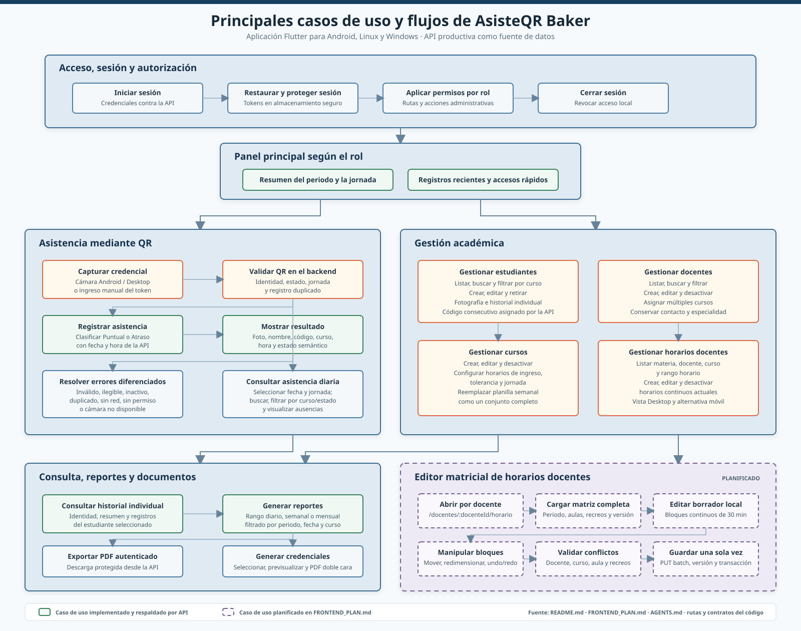

# Diagrama de casos de uso de AsisteQR Baker

El diagrama es una vista histórica anterior a la consolidación actual del
planificador y puede conservar capacidades marcadas como planificadas que ya
existen en el árbol de trabajo. El inventario textual vigente, contrastado con
Flutter y la API, está en [`FLUJOS_FUNCIONALES.md`](FLUJOS_FUNCIONALES.md). El
estado verificable y sus riesgos se mantienen en
[`ESTADO_AUDITORIA_2026-08-22.md`](ESTADO_AUDITORIA_2026-08-22.md) y
[`BITACORA_AUDITORIA.md`](BITACORA_AUDITORIA.md).
